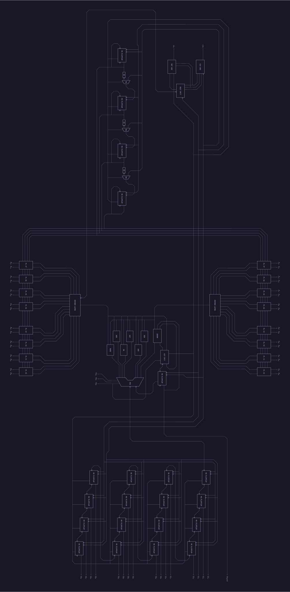
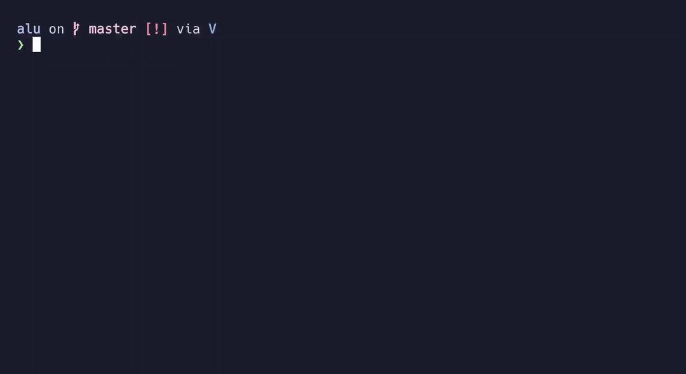

# What is this thing ?

This project aims to design and implement a basic 16 bit ALU which performs the
operations sequentially with a 1 bit ALU having 3 bit wide opcodes, and having
the ability to ADD, SUB and perform 6 other logical operations.

# What's done ?

The design and implementation in verilog is done. And the alutester is almost
done. The documentation is still in #wip.

## Final Schematic of the entire ALU



`alu.v` contains the Verilog implementation of the above schematic. Just for
the kicks, the entire ALU is written in `structural` Verilog. The `testbench.v`
contains a small testbench to test the ALU. For an interactive simulating
experience, use the `alutester`, which is a small `ncurses` based tui C program
to test the ALU. `testbench/` directory contains the source code for the
`alutester`.

# Specification

```
    Inputs
        A - 16 bit number
        B - 16 bit number

        Clk - A clock pulse
        On  - An on signal to start the computation

    Opcodes

        ADD  -  000
        SUB  -  001
        XOR  -  010
        AND  -  011
        NOT  -  100
        OR   -  101
        NOR  -  110
        NAND -  111

    Output
        Out    - 16 bit from memory unit
        Regout - 1 bit from register inside ALU
```

# Compiling and Simulating the ALU

## Prerequisites

In order to compile and simulate the ALU, you need a Verilog compiler and a
simulator. We will be using the `iverilog` as the compiler and `vvp` as the
simulator. In order to simulate the ALU, we need to convert the `*.v` files
into a format that `vvp` can understand (vvp format). That's where the Icarus
Verilog Compiler comes in. The compiler will generate a file that can be used
by `vvp`.

### Installing iverilog and vvp

If you are on Linux based OS, use your beloved package manager to install
the `iverilog` and `vvp`

If you are on Ubuntu, that will be (run these as root):

```sh
apt-get update
apt-get install iverilog
```
This will install `iverilog` and `vvp` on your machine.

### Other Simulation Prerequisites

You also need `make`, that is the build system we are using, and `git`. And if
you wish to use the `alutester` you need the `ncurses` library and a C
compiler. Use `gcc`. (You might also need the `build-essential` package)

```sh
apt install make git gcc build-essential
```

## Clone this Repo


First of all clone this repo and `cd` into it.

```sh
git clone https://github.com/thepenguinn/alu
cd alu
```

## Direct Simulation

In order to simulate, simply run `make`. `make` will take care of compiling
`alu.v` and `testbench.v` into  an `alu` file (vvp format), and simulating that
`alu` file using `vvp`.

```sh
make
```

If you haven't changed anything in the `testbench.v` file, the output will look
something like this.

```
iverilog -o alu -g2012 testbench.v alu.v
vvp alu
Clk  Count            Aluout         Time
  1 1 xxxx xxxxxxxxxxxxxxxxx         2120
  2 1 0000 00000000000000000         3920
  3 1 0001 10000000000000000         5720
  4 1 0010 10000000000000000         7520
  5 1 0011 10000000000000000         9320
  6 1 0100 01000000000000000        11120
  7 1 0101 00100000000000000        12920
  8 1 0110 01010000000000000        14720
  9 1 0111 01101000000000000        16520
 10 1 1000 01110100000000000        18320
 11 1 1001 00111010000000000        20120
 12 1 1010 00011101000000000        21920
 13 1 1011 00001110100000000        23720
 14 1 1100 00000111010000000        25520
 15 1 1101 00000011101000000        27320
 16 1 1110 00000001110100000        29120
 17 1 1111 00000000111010000        30920
 18 1 0000 00000000011101000        32720
 19 1 0000 00000000011101000        34520
 20 1 0000 00000000011101000        36320
 21 1 0000 00000000011101000        38120
 22 1 0000 00000000011101000        39920
 23 1 0000 00000000011101000        41720
 24 1 0000 00000000011101000        43520
 25 1 0000 00000000011101000        45320
 26 1 0000 00000000011101000        47120
 27 1 0000 00000000011101000        48920
 28 1 0000 00000000011101000        50720
 29 1 0000 00000000011101000        52520
 30 1 0000 00000000011101000        54320
 31 1 0000 00000000011101000        56120
 32 1 0000 00000000011101000        57920
testbench.v:62: $finish called at 59700 (1s)
```
As you can see, at the second clock cylce, the aluout and count is
being resetted to zeros.

```
Clk  Count            Aluout         Time
  1 1 xxxx xxxxxxxxxxxxxxxxx         2120
  2 1 0000 00000000000000000         3920  <--- Resetting all the flipflops
  3 1 0001 10000000000000000         5720
  4 1 0010 10000000000000000         7520
```
If you open the `testbench.v`, you could see,

```verilog
        aluon = 1'b0;
        #100;
        aluon = 1'b1;
        #100;
        aluon = 1'b0;
```

We are giving an impulse to `on` pin of the ALU (like pressing a push button).
This will cause the ALU to reset all of its flipflops during the next full
clock cycle. This is the reason for the resetting of the `counter`, the `shift
register`, and the register inside the `one bit alu`.

Once the `counter` hits `1111`, it will cause the ALU to halt the `clock`. And in
turns it halts the entire ALU.

If you look at the output,

```
 16 1 1110 00000001110100000        29120
 17 1 1111 00000000111010000        30920
 18 1 0000 00000000011101000        32720  <--- Clock Halts
 19 1 0000 00000000011101000        34520
```

### Changing the Inputs and Opcodes

Open the `testbench.v`, and go to these lines

```verilog
        aluina = 16'b0000_0000_1100_0111;
        aluinb = 16'b0000_0000_0010_0001;

        aluop = 3'b000;
```

`aluina` and `aluinb` are the A and B inputs to the ALU. And `aluop` is
the is the 3 bit wide `opcode` to the ALU.

Change the A and B inputs as you wish, and choose the correct `opcode`
(see the Specification) and run `make` again.

## Simulation Using alutester

`alutester` is an ncurses based tui C program to test the ALU interactivly.
To compile and run, run these command from the root directory of this repo.

```sh
make runtest
```

(NOTE: Don't change the name of `alu.v` file. Otherwise you have to modify
it inside `alutester`'s source too.)

This will compile the `alutester` and runs it.



### Using alutester

Basically while you are in `alutester`, you are in different modes (just like in
vim). Currently there are two modes implemented: `Normal Mode` and `Bit Mode`

#### Normal Mode

When you start `alutester`, you will be in `Normal Mode`. You can use h,j,k,l
to move around (ofcourse, vim bindings) to A input, B input and opcode. Once
you selected the bit group you want to change, press `Enter` to switch to `Bit
Mode`.

- h -> move left
- j -> move down
- k -> move up
- l -> move right

#### Bit Mode

In `Bit Mode` you can manipulate bits. Press h and l to move left and right
respectively. Pressing j and k will flip the current bit. Current bit will be
hightlighted in `Bit Mode`. (Note: the current bit will be remembered even
after leaving and entering the `Bit Mode`.) To leave `Bit Mode` just press
escape or Ctrl[.

- h   -> move left
- j,k -> flips the bit
- l   -> move right

#### Running Simulation

Once you finished choosing the operands and opcodes, you can press `r` while
you are in `Normal Mode`. `alutester` will compile and simulate the ALU for
you. Once that's done, you can see the bit at the top left corner changes to
`0` from `X` (if you are running for the first time). Its the clock state. Now
you can press `n` to step forward through half clock cycle. This will toggle
the clock, and you can see the output changing as you step through. Similarly,
`p` steps backwards.

- r -> runs the simulation
- n -> steps forewards
- p -> steps backwards

#### Quitting alutester

<details>
<summary>Please turn off your computer.</summary>
Just kidding press <code>q</code> while you are in <code>Normal Mode</code>
</details>

# Rest of the README

#wip
